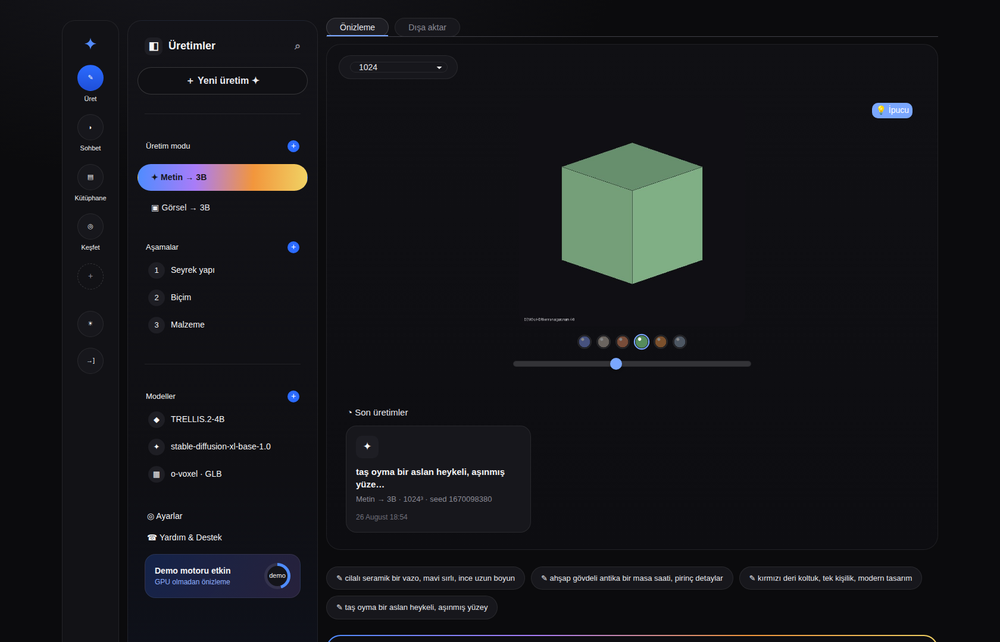
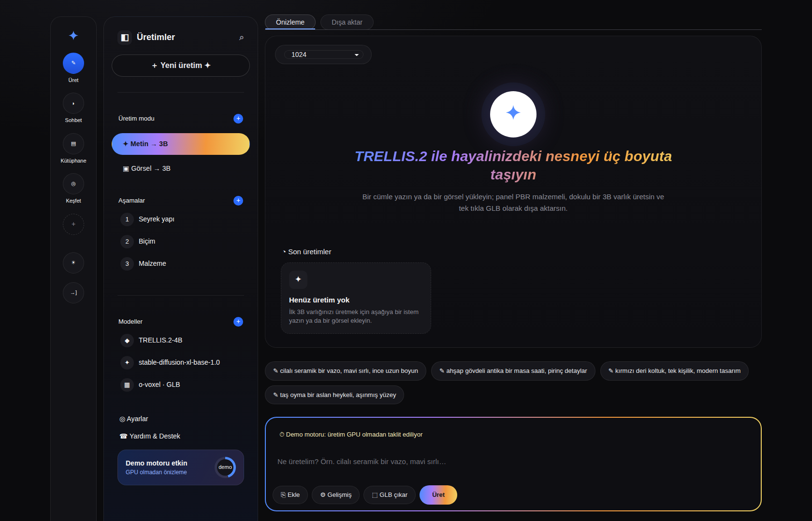

# TRELLIS.2 Paneli — Metin → 3B ve Görsel → 3B

[microsoft/TRELLIS.2](https://github.com/microsoft/TRELLIS.2) modeliyle 3B varlık
üreten Gradio paneli. Arayüz, verilen referans tasarıma göre kurgulanmıştır:
solda ikon rayı, yanında koyu kenar çubuğu (üretim modu, aşamalar, modeller ve
durum kartı), ortada sekme çipleri + kahraman bölümü + son üretim kartları ve
altta degrade çerçeveli yazım alanı (Ekle / Gelişmiş / GLB çıkar / Üret).





## Ne yapar

| Sekme | Girdi | Akış |
|-------|-------|------|
| **Görsel → 3B** | `.png` / `.jpg` (tercihen tek nesne) | Görsel ön işleme → TRELLIS.2 → PBR mesh |
| **Metin → 3B** | serbest metin | Metin → görsel (diffusers) → ön işleme → TRELLIS.2 → PBR mesh |

TRELLIS.2 yalnızca **görselden** 3B üretir. Metinden 3B için panel iki aşama
çalıştırır: istemden tek nesneli, sade zeminli bir görsel üretilir (varsayılan
`stabilityai/stable-diffusion-xl-base-1.0`), ardından bu görsel TRELLIS.2'ye
verilir. Üretilen ara görsel arayüzde de gösterilir.

Önizleme, 6 render modu (Normal, Kil, Taban rengi, HDRI orman/gün batımı/avlu)
× 8 görüş açısı = 48 kareyi tek seferde tarayıcıya gömer; mod düğmeleri ve açı
kaydırıcısı sunucuya gitmeden çalışır. **GLB çıkar** adımı, TRELLIS.2'nin
`o_voxel.postprocess.to_glb` fonksiyonuyla dokulu `.glb` üretir ve indirtir.

## Kurulum

Gerçek üretim için TRELLIS.2'nin kendi gereksinimleri geçerlidir: **Linux,
NVIDIA GPU (≥24 GB VRAM), CUDA 12.4, Python 3.8+**.

```bash
# 1) TRELLIS.2'yi kurun (kendi deposunda)
git clone https://github.com/microsoft/TRELLIS.2
cd TRELLIS.2
. ./setup.sh --new-env --basic --flash-attn --nvdiffrast --nvdiffrec --cumesh --o-voxel --flexgemm

# 2) Panel bağımlılıkları (aynı ortamda)
pip install -r /yol/DWG-3D-Viewer/trellis3d/requirements.txt
pip install diffusers transformers accelerate      # metin → görsel aşaması için

# 3) Paneli başlatın
cd /yol/DWG-3D-Viewer/trellis3d
TRELLIS2_ROOT=/yol/TRELLIS.2 python app.py
```

`TRELLIS2_ROOT`, HDRI ortam haritalarının (`assets/hdri/*.exr`) ve örnek
görsellerin okunduğu TRELLIS.2 deposunu gösterir.

## GPU'suz deneme (demo modu)

Model ve GPU olmadan arayüzün tamamını çalıştırır; üretim yerine basit yer
tutucu görseller ve geçerli bir yer tutucu `.glb` üretilir.

```bash
pip install -r requirements.txt
python app.py --mock
```

## Seçenekler

| Bayrak | Ortam değişkeni | Varsayılan |
|--------|-----------------|------------|
| `--trellis-root` | `TRELLIS2_ROOT` | çalışma dizini |
| `--model` | `TRELLIS2_MODEL` | `microsoft/TRELLIS.2-4B` |
| `--t2i-model` | `TRELLIS2_T2I_MODEL` | `stabilityai/stable-diffusion-xl-base-1.0` |
| `--mock` | `TRELLIS2_PANEL_MOCK` | kapalı |
| `--host` / `--port` | `TRELLIS2_PANEL_HOST` / `TRELLIS2_PANEL_PORT` | `127.0.0.1` / `7860` |
| `--share` | `TRELLIS2_PANEL_SHARE` | kapalı |

Metin→görsel modelinin adında `flux` geçiyorsa `FluxPipeline`, aksi halde
`AutoPipelineForText2Image` kullanılır.

### Üretim ayarları

* **Çözünürlük** — `512`, `1024` (cascade), `1536` (cascade).
* **Seed** — sabitlenebilir ya da her üretimde rastgele seçilebilir.
* **Üçgen hedefi / Doku boyutu** — GLB çıkarımında decimation ve doku çözünürlüğü.
* **Gelişmiş ayarlar** — üç aşama (seyrek yapı, biçim, malzeme) için rehberlik
  gücü, rehberlik ölçeği, örnekleme adımı ve `rescale_t`. Varsayılanlar
  TRELLIS.2 demosuyla aynıdır.

## Arayüz haritası

| Bölge | İçerik |
|-------|--------|
| İkon rayı | Üret / Sohbet / Kütüphane / Keşfet kısayolları |
| Kenar çubuğu | Yeni üretim, **Üretim modu** (Metin → 3B / Görsel → 3B), üç aşama, yüklü modeller, motor durumu |
| Sekme çipleri | **Önizleme** ve **Dışa aktar** adımları |
| Kahraman bölümü | İlk açılışta gösterilir; ilk üretimden sonra yerini önizleyiciye bırakır |
| Son üretimler | Her üretim kart olarak eklenir (kaynak, çözünürlük, seed, zaman) |
| Yazım alanı | İstem kutusu + **Ekle** (görsel), **Gelişmiş** (ayarlar), **GLB çıkar**, **Üret** |

**Ekle** ile görsel yüklendiğinde üretim modu kendiliğinden *Görsel → 3B*'ye
geçer ve küçük önizleme yazım alanında görünür.

## Doğrulama

Duman testi paneli sahte motorla uçtan uca çalıştırır (GPU gerekmez):

```bash
python tools/smoke_test.py
```

Denetlenenler: arayüz kurulumu, metin→3B ve görsel→3B akışları, önizleyicinin
48 karesi, tek görünür kare kuralı, geçerli GLB başlığı ve boş girdi hataları.

## Dosya düzeni

```
trellis3d/
├── app.py                    giriş noktası (argparse + launch)
├── requirements.txt
├── tools/smoke_test.py       GPU'suz uçtan uca test
└── trellis_panel/
    ├── config.py             modlar, çözünürlükler, ayarlar
    ├── panel.py              Gradio yerleşimi ve olay bağlantıları
    ├── engine.py             Trellis2Engine (GPU) + MockEngine (demo)
    ├── text2image.py         metin → görsel aşaması
    ├── ui.py                 önizleyici CSS/JS/HTML
    ├── theme.py              koyu tema CSS'i ve statik arayüz parçaları
    ├── assets.py             ikon üretimi, base64 gömme
    └── glb.py                demo modu için minimal GLB yazıcı
```

Önizleyicinin CSS/JS'i, TRELLIS.2 deposundaki `app.py`'den uyarlanmıştır
(MIT Lisansı, Copyright (c) Microsoft Corporation).
